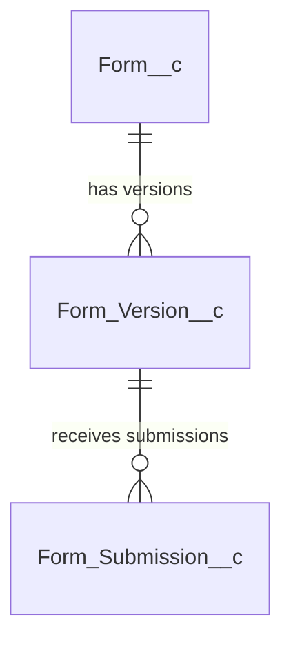

# Modern Salesforce Form Builder - "From Scratch" Design Specification
## Document-Based (JSON Schema) Architecture

## 1. Architectural Vision & Core Principles

This specification details a modern, native Salesforce Form Builder built entirely **from scratch**. It rejects the traditional relational database approach (storing pages, sections, and elements in distinct child tables) in favor of a **Document-Based (JSON Schema) Architecture**.

### 1.1 Why a Document-Based Model?
1. **AI Native**: The AI can generate or customize the entire form—including pages, column layouts, custom fields, data mappings, validation rules, and themes—in a single execution transaction by returning a single validated JSON payload.
2. **Extreme Performance**: Renders in the browser with exactly **one SOQL query** to load the form definition, instead of nested SOQL loops over multiple custom metadata or data objects.
3. **Draft Safety & Deployment**: Editing a form draft does not mutate live tables. Publishing simply creates a new version record containing the JSON definition, making rollback and staging migrations trivial.
4. **AppExchange Review Proof**: All layout variations, styles, and visual hooks are applied securely via dynamic CSS custom properties and LWC structure selectors, avoiding dynamic HTML rendering (`innerHTML`).

---

## 2. The Data Model (Built from Scratch)

By discarding the objects `Form_Page__c`, `Form_Section__c`, `Form_Element__c`, and `Element_Lookup_Mapping__c`, the database is simplified to just three core objects.

### 2.1 Entity Relationship Diagram (ERD)



---

### 2.2 Schema Definitions

#### 1. Form Registry: `Form__c`
*Purpose: Master record representing the form.*

| Field API Name | Field Type | Length | Required | Description |
| :--- | :--- | :--- | :--- | :--- |
| `Name` | Text | 80 | Yes | Human-readable name (e.g., "Onboarding Wizard") |
| `Primary_Object__c` | Text | 255 | Yes | API Name of target primary SObject (e.g., `Lead`, `Account`) |
| `Status__c` | Picklist | - | Yes | `Draft`, `Published`, `Archived` (Default: `Draft`) |
| `Form_Type__c` | Picklist | - | Yes | `Form`, `Survey` (Default: `Form`) |
| `Active_Version__c` | Lookup | Form_Version__c | No | Lookup to the live, published version |

---

#### 2. Form Version Definition: `Form_Version__c`
*Purpose: Holds the immutable JSON snapshot representing the entire form layout, styles, validation, and data mapping.*

| Field API Name | Field Type | Length | Required | Description |
| :--- | :--- | :--- | :--- | :--- |
| `Form__c` | Master-Detail | Form__c | Yes | Parent Form association |
| `Version_Number__c` | Number | 18, 0 | Yes | Version counter (1, 2, 3...) |
| `Is_Active__c` | Checkbox | - | Yes | Checked if this is the active live layout |
| `Form_Definition_JSON__c` | Long Text | 131,072 | Yes | The entire form structure, styling, and mappings (See Section 3) |
| `Schema_Snapshot__c` | Long Text | 131,072 | Yes | Snapshot of Salesforce fields metadata to validate offline submissions |
| `Published_By__c` | Lookup | User | No | User who published this version |
| `Published_Date__c` | DateTime | - | Yes | Timestamp of publication |

---

#### 3. Form Submission receipt: `Form_Submission__c`
*Purpose: Logs form submissions and tracks generated Salesforce records.*

| Field API Name | Field Type | Length | Required | Description |
| :--- | :--- | :--- | :--- | :--- |
| `Form_Version__c` | Lookup | Form_Version__c | Yes | The form version filled by the user |
| `Submitted_Date__c` | DateTime | - | Yes | Timestamp of submission |
| `Submitted_By__c` | Lookup | User | No | User who submitted the form (Null for guest users) |
| `Primary_Record_Id__c` | Id | 18 | No | ID of the primary Salesforce record created or updated |
| `Status__c` | Picklist | - | Yes | `Pending`, `Processed`, `Failed` (Default: `Pending`) |
| `Submission_Payload__c` | Long Text | 131,072 | Yes | JSON containing all submitted question-answer structures |

---

### 2.3 Performance & Indexing
Only one custom index is required to maintain maximum scale:
*   `Form_Version__c`: Composite Index on `Form__c` + `Is_Active__c`. Ensures instant lookup of the active layout during player initialization.

---

## 3. Unified Form JSON Document Schema

The entire structure, visual theme, input elements, validation, and database mapping are defined inside `Form_Definition_JSON__c` following this schema:

```json
{
  "layout": {
    "variant": "split-page",
    "sidebarPosition": "left",
    "cardStyle": "elevated",
    "animation": "fade-in",
    "header": {
      "logoUrl": "https://company.logo/logo.png",
      "title": "Partner Application",
      "subtitle": "Submit your company info",
      "highlights": "Active recruitment for FY27.",
      "richText": "<p>Read terms and conditions before submitting.</p>"
    }
  },
  "theme": {
    "colors": {
      "bg": "#0f172a",
      "text": "#f8fafc",
      "inputBg": "#1e293b",
      "inputBorder": "#3b82f6",
      "label": "#94a3b8"
    },
    "typography": {
      "fontFamily": "'Inter', sans-serif",
      "borderRadius": "12px"
    }
  },
  "pages": [
    {
      "pageId": "page_1",
      "title": "Company Details",
      "sections": [
        {
          "sectionId": "sec_basic_info",
          "title": "Basic Details",
          "gridColumns": 2,
          "collapsible": true,
          "elements": [
            {
              "key": "acc_name",
              "type": "field",
              "label": "Company Name",
              "fieldApiName": "Name",
              "required": true,
              "renderAs": "text",
              "columnSpan": 2
            },
            {
              "key": "acc_revenue",
              "type": "field",
              "label": "Annual Revenue",
              "fieldApiName": "AnnualRevenue",
              "required": false,
              "renderAs": "number",
              "minValue": 10000,
              "columnSpan": 1
            }
          ]
        }
      ]
    }
  ],
  "relatedLists": [
    {
      "relationshipName": "Contacts",
      "childSObject": "Contact",
      "displayMode": "tile-menu",
      "gridColumns": 2,
      "fields": [
        { "key": "c_fname", "fieldApiName": "FirstName", "label": "First Name", "required": false },
        { "key": "c_lname", "fieldApiName": "LastName", "label": "Last Name", "required": true }
      ]
    }
  ]
}
```

---

## 4. AI Prompt Engine & Agent Integration

Admin can customize layout styles by writing prompts inside the Form Builder workspace.

### 4.1 Einstein Prompt Builder Config

```text
You are an expert LWC & CSS Architect. Your job is to take a User Design Request, analyze the target SObject fields, and modify or generate a unified Form Definition JSON.

User Design Request: {!$Input.User_Style_Request}
Target SObject Fields: {!$Input.SObject_Fields}
Existing Form Definition (empty if new): {!$Input.Existing_JSON}

Layout Varieties Rules:
- "single-page": Continuous vertical layout.
- "multi-page": Split wizard pages.
- "split-page": Left/Right split (Header sidebar + main content panel).
- "sidebar": Left navigation panels.
- "modal": Focused popups.

Grid columns: Renders elements inside sections using grids of 1, 2, 3, or 4 columns.

Output only valid hex codes or rgba() strings for colors.
Do NOT use markdown wraps (```json). Output raw, unescaped JSON matching the layout definition schema.
```

---

### 4.2 Apex Action Controller (`FormAISpecGenerator`)

```apex
public with sharing class FormAISpecGenerator {
    
    public class AIRequest {
        @InvocableVariable(required=true label='Form ID')
        public Id formId;
        @InvocableVariable(required=true label='User Prompt')
        public String userPrompt;
    }
    
    public class AIResponse {
        @InvocableVariable(label='Updated Form Definition JSON')
        public String updatedFormDefinition;
    }
    
    @InvocableMethod(category='AI Form' label='Generate Form Design Spec' description='Uses Prompt Builder to generate or modify Form JSON definitions.')
    public static List<AIResponse> generateFormJSON(List<AIRequest> requests) {
        List<AIResponse> responses = new List<AIResponse>();
        
        for (AIRequest req : requests) {
            AIResponse res = new AIResponse();
            
            // 1. Fetch current Form definition state
            Form__c form = [SELECT Id, Primary_Object__c, AI_Theme_Config__c 
                            FROM Form__c 
                            WHERE Id = :req.formId 
                            WITH USER_MODE];
            
            // 2. Resolve SObject Describe fields for the prompt input context
            String objectFieldsDesc = getObjectFieldSummary(form.Primary_Object__c);
            
            // 3. Connect to prompt template
            Map<String, Object> inputs = new Map<String, Object>();
            inputs.put('User_Style_Request', req.userPrompt);
            inputs.put('SObject_Fields', objectFieldsDesc);
            inputs.put('Existing_JSON', form.AI_Theme_Config__c != null ? form.AI_Theme_Config__c : '{}');
            
            ConnectApi.EinsteinPromptExecutionResult result = 
                ConnectApi.Einstein.executePromptTemplate('Form_Design_Generator', inputs);
            
            String responseJson = result.generationText.trim();
            
            // 4. Schema verification parser
            Map<String, Object> validation = (Map<String, Object>) JSON.deserializeUntyped(responseJson);
            if (validation.containsKey('layout') && validation.containsKey('pages')) {
                form.AI_Theme_Config__c = responseJson;
                update as user form;
                res.updatedFormDefinition = responseJson;
            }
            responses.add(res);
        }
        return responses;
    }
    
    private static String getObjectFieldSummary(String sObjectType) {
        List<String> fieldDescs = new List<String>();
        Map<String, Schema.SObjectField> fieldsMap = Schema.getGlobalDescribe().get(sObjectType).getDescribe().fields.getMap();
        for (String key : fieldsMap.keySet()) {
            Schema.DescribeFieldResult dfr = fieldsMap.get(key).getDescribe();
            if (dfr.isCreateable() || dfr.isUpdateable()) {
                fieldDescs.add(dfr.getName() + ' (' + dfr.getType().name() + ')');
            }
        }
        return String.join(fieldDescs, ', ');
    }
}
```

---

## 5. Security & Rendering Engine (LWC Player)

To guarantee AppExchange compliance, the player LWC processes the JSON layout document securely.

### 5.1 Style Sandbox Sanitizer (`formSanitizer.js`)

```javascript
/**
 * Security Engine: Sanitizes dynamic JSON attributes before applying them to host properties.
 */
const COLOR_REG = /^#([A-Fa-f0-9]{3,4}|[A-Fa-f0-9]{6}|[A-Fa-f0-9]{8})$|^rgba?\([^)]+\)$|^[a-zA-Z]+$/;
const SIZE_REG = /^\d+(\.\d+)?(px|rem|em|%|vh|vw)$|^auto$/;
const FONT_REG = /^[a-zA-Z0-9\s?,'"-]+$/;

export function sanitizeStyle(value, type) {
    if (!value || typeof value !== 'string') return '';
    
    const lower = value.toLowerCase();
    
    // STRICT SECURITY BLOCK: Reject any pixel tracking or server requests
    if (lower.includes('url') || 
        lower.includes('expression') || 
        lower.includes('javascript') || 
        lower.includes('..')) {
        console.warn('Blocked malicious style property signature:', value);
        return '';
    }
    
    const clean = value.trim();
    switch (type) {
        case 'color':
            return COLOR_REG.test(clean) ? clean : '';
        case 'size':
            return SIZE_REG.test(clean) ? clean : '';
        case 'font':
            return FONT_REG.test(clean) ? clean : '';
        default:
            return '';
    }
}
```

---

### 5.2 Secure DOM Styler (`formPlayer.js`)

```javascript
import { LightningElement, api, track } from 'lwc';
import { sanitizeStyle } from 'c/formSanitizer';

export default class FormPlayer extends LightningElement {
    @api formDefinitionJson; // Loaded from Form_Version__c
    @track formDefinition = {};
    @track activePageIdx = 0;

    connectedCallback() {
        if (this.formDefinitionJson) {
            this.formDefinition = JSON.parse(this.formDefinitionJson);
        }
    }

    renderedCallback() {
        this.applyThemeStyles();
    }

    applyThemeStyles() {
        const container = this.template.querySelector('[data-id="formContainer"]');
        if (!container || !this.formDefinition.theme) return;

        const colors = this.formDefinition.theme.colors || {};
        const typography = this.formDefinition.theme.typography || {};

        const safeBg = sanitizeStyle(colors.bg, 'color');
        const safeText = sanitizeStyle(colors.text, 'color');
        const safeInputBg = sanitizeStyle(colors.inputBg, 'color');
        const safeInputBorder = sanitizeStyle(colors.inputBorder, 'color');
        const safeLabel = sanitizeStyle(colors.label, 'color');
        
        const safeFont = sanitizeStyle(typography.fontFamily, 'font');
        const safeRadius = sanitizeStyle(typography.borderRadius, 'size');

        // Apply via standard style setters (completely immune to semicolon breakouts)
        if (safeBg) container.style.setProperty('--form-bg', safeBg);
        if (safeText) container.style.setProperty('--form-text-color', safeText);
        if (safeInputBg) container.style.setProperty('--form-input-bg', safeInputBg);
        if (safeInputBorder) container.style.setProperty('--form-input-border', safeInputBorder);
        if (safeLabel) container.style.setProperty('--form-label-color', safeLabel);
        if (safeFont) container.style.setProperty('--form-font-family', safeFont);
        if (safeRadius) container.style.setProperty('--form-border-radius', safeRadius);
    }

    get containerClass() {
        const layout = this.formDefinition.layout || {};
        const variant = layout.variant || 'single-page';
        const card = layout.cardStyle || 'flat';
        return `form-wrapper layout-${variant} card-${card}`;
    }

    get activePage() {
        if (!this.formDefinition.pages) return null;
        return this.formDefinition.pages[this.activePageIdx];
    }
}
```

---

## 6. Structural Layout & CSS Grid Blueprints

All structural CSS layout variants (Single-Page, Multi-Page, Split-Page, Sidebar, Modal) are declared statically inside `formPlayer.css`. The parent class controls how the layout behaves.

### 6.1 Stylesheet: `formPlayer.css`

```css
:host {
    display: block;
    --form-bg: #ffffff;
    --form-text-color: #1e293b;
    --form-input-bg: #f8fafc;
    --form-input-border: #cbd5e1;
    --form-label-color: #475569;
    --form-font-family: sans-serif;
    --form-border-radius: 8px;
}

.form-wrapper {
    background-color: var(--form-bg);
    color: var(--form-text-color);
    font-family: var(--form-font-family);
    min-height: 100vh;
    box-sizing: border-box;
}

/* -------------------------------------------------------------
   Layout 1: Single Page (Continuous scroll)
   ------------------------------------------------------------- */
.layout-single-page {
    max-width: 960px;
    margin: 0 auto;
    padding: 3rem 1.5rem;
}

/* -------------------------------------------------------------
   Layout 2: Multi-Page (wizard)
   ------------------------------------------------------------- */
.layout-multi-page {
    max-width: 800px;
    margin: 0 auto;
    padding: 4rem 2rem;
}

/* -------------------------------------------------------------
   Layout 3: Split-Page (Side context + side inputs)
   ------------------------------------------------------------- */
.layout-split-page {
    display: grid;
    grid-template-columns: 1fr 1.2fr;
    min-height: 100vh;
}
.layout-split-page .context-panel {
    background-color: rgba(0, 0, 0, 0.05);
    padding: 4rem;
    display: flex;
    flex-direction: column;
    justify-content: center;
}
.layout-split-page .input-panel {
    padding: 4rem;
    overflow-y: auto;
}

/* -------------------------------------------------------------
   Layout 4: Sidebar Navigation
   ------------------------------------------------------------- */
.layout-sidebar {
    display: grid;
    grid-template-columns: 280px 1fr;
    min-height: 100vh;
}
.layout-sidebar .sidebar-menu {
    border-right: 1px solid rgba(0, 0, 0, 0.1);
    padding: 2rem;
}
.layout-sidebar .main-content {
    padding: 3rem;
}

/* -------------------------------------------------------------
   Layout 5: Modal Layout
   ------------------------------------------------------------- */
.layout-modal-backdrop {
    position: fixed;
    top: 0;
    left: 0;
    width: 100vw;
    height: 100vh;
    background-color: rgba(15, 23, 42, 0.6);
    display: flex;
    align-items: center;
    justify-content: center;
}
.layout-modal-content {
    background-color: var(--form-bg);
    border-radius: var(--form-border-radius);
    max-width: 650px;
    width: 90%;
    padding: 2.5rem;
    box-shadow: 0 20px 25px -5px rgba(0,0,0,0.1);
}

/* -------------------------------------------------------------
   Card Styles
   ------------------------------------------------------------- */
.card-elevated .form-section-card {
    border: 1px solid rgba(0, 0, 0, 0.05);
    box-shadow: 0 4px 6px -1px rgba(0, 0, 0, 0.05);
    border-radius: var(--form-border-radius);
    padding: 2rem;
    margin-bottom: 2rem;
}
```

---

### 6.2 Responsive Dynamic Column Grids (`formSection.css`)

```css
.grid-container {
    display: grid;
    gap: 1.5rem;
}

.columns-1 { grid-template-columns: 1fr; }
.columns-2 { grid-template-columns: repeat(2, 1fr); }
.columns-3 { grid-template-columns: repeat(3, 1fr); }
.columns-4 { grid-template-columns: repeat(4, 1fr); }

@media (max-width: 768px) {
    .columns-2, .columns-3, .columns-4 {
        grid-template-columns: 1fr;
    }
}
```

---

## 7. Submission Processing (The DML Engine)

Submitting a document-based form requires dynamic mapping back to Salesforce SObjects. The Apex `FormSubmissionController` handles transaction processing, security checks, and relationship linking.

```apex
public with sharing class FormSubmissionController {
    
    public class SubmissionPayload {
        @AuraEnabled public Id formVersionId;
        @AuraEnabled public String responseJson; // Data entered (Key => Value)
    }

    @AuraEnabled
    public static Map<String, String> processSubmission(SubmissionPayload payload) {
        Map<String, String> result = new Map<String, String>();
        Savepoint sp = Database.setSavepoint();

        try {
            // 1. Fetch Form Version configuration
            Form_Version__c version = [SELECT Id, Form__r.Primary_Object__c, Form_Definition_JSON__c, Schema_Snapshot__c 
                                       FROM Form_Version__c 
                                       WHERE Id = :payload.formVersionId 
                                       WITH USER_MODE];
                                       
            Map<String, Object> definition = (Map<String, Object>) JSON.deserializeUntyped(version.Form_Definition_JSON__c);
            Map<String, Object> responses = (Map<String, Object>) JSON.deserializeUntyped(payload.responseJson);

            // 2. Validate CRUD access on Primary SObject
            String primarySObject = version.Form__r.Primary_Object__c;
            if (!Schema.getGlobalDescribe().get(primarySObject).getDescribe().isCreateable()) {
                throw new AuraHandledException('Insufficient permissions to create ' + primarySObject);
            }

            // 3. Construct Primary SObject Record
            SObject primaryRecord = Schema.getGlobalDescribe().get(primarySObject).newSObject();
            
            // Map primary fields defined in pages
            List<Object> pages = (List<Object>) definition.get('pages');
            for (Object page : pages) {
                Map<String, Object> pMap = (Map<String, Object>) page;
                List<Object> sections = (List<Object>) pMap.get('sections');
                for (Object section : sections) {
                    Map<String, Object> sMap = (Map<String, Object>) section;
                    List<Object> elements = (List<Object>) sMap.get('elements');
                    for (Object element : elements) {
                        Map<String, Object> el = (Map<String, Object>) element;
                        if (el.get('type') == 'field') {
                            String key = (String) el.get('key');
                            String fieldApiName = (String) el.get('fieldApiName');
                            if (responses.containsKey(key)) {
                                primaryRecord.put(fieldApiName, responses.get(key));
                            }
                        }
                    }
                }
            }

            // 4. Secure DML insertion via Security Decider
            SObjectAccessDecision decision = Security.stripInaccessible(AccessType.CREATABLE, new List<SObject>{ primaryRecord });
            insert decision.getRecords();
            Id primaryRecordId = decision.getRecords()[0].Id;

            // 5. Process Child Relationship Collections (Related Lists)
            if (definition.containsKey('relatedLists')) {
                List<Object> relatedLists = (List<Object>) definition.get('relatedLists');
                List<SObject> childRecordsToInsert = new List<SObject>();
                
                for (Object relList : relatedLists) {
                    Map<String, Object> rMap = (Map<String, Object>) relList;
                    String childSObject = (String) rMap.get('childSObject');
                    String relationshipName = (String) rMap.get('relationshipName');
                    
                    // Locate target lookup field on child referencing parent
                    String lookupFieldApiName = findLookupField(childSObject, primarySObject);
                    
                    if (responses.containsKey(relationshipName)) {
                        List<Object> childRows = (List<Object>) responses.get(relationshipName);
                        for (Object rowObj : childRows) {
                            Map<String, Object> row = (Map<String, Object>) rowObj;
                            SObject childRecord = Schema.getGlobalDescribe().get(childSObject).newSObject();
                            
                            // Link child to primary parent ID
                            childRecord.put(lookupFieldApiName, primaryRecordId);
                            
                            List<Object> relFields = (List<Object>) rMap.get('fields');
                            for (Object rField : relFields) {
                                Map<String, Object> rf = (Map<String, Object>) rField;
                                String key = (String) rf.get('key');
                                String fieldApi = (String) rf.get('fieldApiName');
                                if (row.containsKey(key)) {
                                    childRecord.put(fieldApi, row.get(key));
                                }
                            }
                            childRecordsToInsert.add(childRecord);
                        }
                    }
                }
                
                if (!childRecordsToInsert.isEmpty()) {
                    SObjectAccessDecision childDecision = Security.stripInaccessible(AccessType.CREATABLE, childRecordsToInsert);
                    insert childDecision.getRecords();
                }
            }

            // 6. Log Form Submission
            Form_Submission__c submission = new Form_Submission__c(
                Form_Version__c = version.Id,
                Primary_Record_Id__c = primaryRecordId,
                Submitted_Date__c = System.now(),
                Status__c = 'Processed',
                Submission_Payload__c = payload.responseJson
            );
            insert as user submission;

            result.put('status', 'SUCCESS');
            result.put('recordId', primaryRecordId);
            return result;
            
        } catch (Exception e) {
            Database.rollback(sp);
            throw new AuraHandledException('Submission Processing Failed: ' + e.getMessage());
        }
    }

    private static String findLookupField(String childObject, String parentObject) {
        Map<String, Schema.SObjectField> childFields = Schema.getGlobalDescribe().get(childObject).getDescribe().fields.getMap();
        for (String fieldName : childFields.keySet()) {
            Schema.DescribeFieldResult dfr = childFields.get(fieldName).getDescribe();
            if (dfr.getType() == Schema.DisplayType.REFERENCE) {
                for (Schema.SObjectType targetObj : dfr.getReferenceTo()) {
                    if (targetObj.getDescribe().getName() == parentObject) {
                        return dfr.getName();
                    }
                }
            }
        }
        throw new AuraHandledException('Could not resolve lookup link between ' + childObject + ' and ' + parentObject);
    }
}
```
