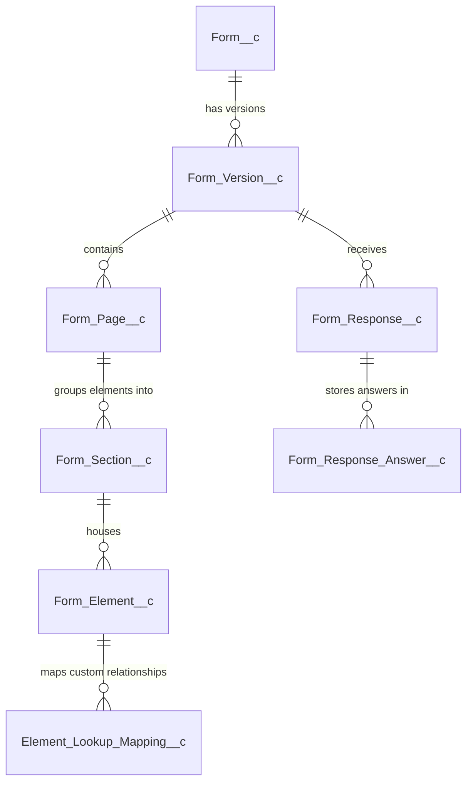
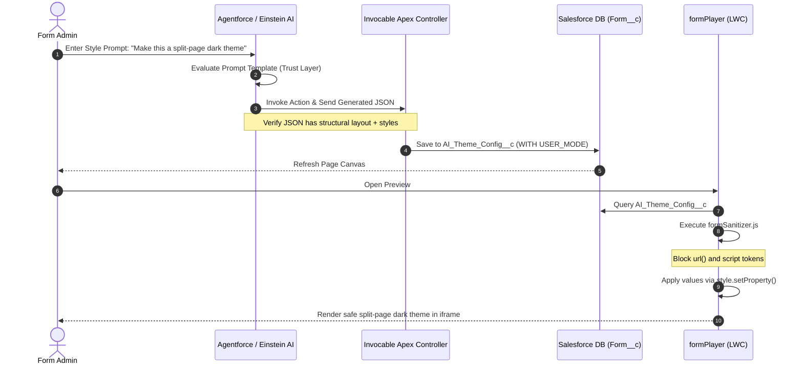

# Salesforce AI-Driven Form Builder - Technical Design & Data Model Specification

## 1. Executive Summary & Vision

This document details the architecture, data model, and security implementation for a native Salesforce Form Builder. The redesign introduces **AI-driven styling, theme configuration, and layout layouts** orchestrated by Agentforce/Einstein Prompt Builder, while keeping the rendering engine strictly secure, performant, and compliant with **AppExchange Security Review** guidelines.

### Core Architecture Goal
To completely decouple **Visual Presentation (Styles/Themes)** from **Functional Layout (Components/Data)**. The AI produces a structured, tokenized JSON theme configuration that is validated and applied at runtime via safe web APIs, avoiding raw CSS injections or unvalidated HTML rendering.

```
+------------------------------------+
|  Agentforce/Einstein Prompt Builder|
+------------------------------------+
                  │
                  ▼ (Structured JSON Token payload)
+------------------------------------+
|  Apex Service (Validation & DML)   |
+------------------------------------+
                  │
                  ▼ (Saved to Form__c.AI_Theme_Config__c)
+------------------------------------+
|      LWC formPlayer Engine         |
|  • Sanitizes styles client-side    |
|  • Sets variables via property-API |
|  • Mutates CSS Grid classes        |
+------------------------------------+
```

---

## 2. Salesforce Custom Object Schema (The Data Model)

To support primary objects, child relationships, multi-page routing, grid layouts, and AI configurations, we define the following Salesforce Custom Objects.

### 2.1 Entity Relationship Diagram (ERD)



---

### 2.2 Schema Definitions

#### 1. Form definition: `Form__c`
*Purpose: Master form registry holding metadata, context config, and active AI styles.*

| Field API Name | Field Type | Length / Scale | Required | Description / Config |
| :--- | :--- | :--- | :--- | :--- |
| `Name` | Text | 80 | Yes | Name of the form (e.g., "Customer Feedback") |
| `Status__c` | Picklist | - | Yes | `Draft`, `Published`, `Archived` |
| `Primary_Context_Object__c` | Text | 255 | Yes | Target SObject API Name (e.g., `Account`, `Lead`, `Custom_Obj__c`) |
| `Form_Type__c` | Picklist | - | Yes | `Form`, `Survey` |
| `Layout_Mode__c` | Picklist | - | Yes | `Single_Page`, `Vertical_Navigation` (Default: `Single_Page`) |
| `AI_Theme_Config__c` | Long Text Area | 131,072 | No | JSON configuration payload generated by AI styling engine |
| `Schema_Snapshot__c` | Long Text Area | 131,072 | No | Frozen SObject describe metadata for validation (Required on Publish) |
| `Default_Owner_Id__c` | Lookup | User | No | Default Owner assigned when guest users submit records |

**Validation Rules:**
- `VR_Primary_Object_API_Format`: Enforces valid API name syntax.
  ```apex
  AND(
    NOT(ISBLANK(Primary_Context_Object__c)),
    NOT(REGEX(Primary_Context_Object__c, "^[A-Za-z][A-Za-z0-9_]*(__c)?$"))
  )
  ```

---

#### 2. Form Versioning: `Form_Version__c`
*Purpose: Immutable published version records to support historical analysis and prevent schema drift.*

| Field API Name | Field Type | Length / Scale | Required | Description / Config |
| :--- | :--- | :--- | :--- | :--- |
| `Form__c` | Master-Detail | Form__c | Yes | Parent Form association |
| `Version_Number__c` | Number | 18, 0 | Yes | Semantic version counter (1, 2, 3...) |
| `Is_Active__c` | Checkbox | - | Yes | Evaluates if this is the live rendering configuration |
| `AI_Theme_Config__c` | Long Text Area | 131,072 | Yes | Snapshotted AI theme configuration |
| `Schema_Snapshot__c` | Long Text Area | 131,072 | Yes | Snapshotted Salesforce schema definitions |
| `Change_Notes__c` | Long Text Area | 32,768 | No | Description of edits made in this release |

---

#### 3. Form Pages: `Form_Page__c`
*Purpose: Progressive disclosure and wizard/step configuration.*

| Field API Name | Field Type | Length / Scale | Required | Description / Config |
| :--- | :--- | :--- | :--- | :--- |
| `Name` | Text | 80 | Yes | Page title/header |
| `Form_Version__c` | Master-Detail | Form_Version__c | Yes | Associated form version |
| `Sequence__c` | Number | 18, 0 | Yes | Sorting sequence (1, 2, 3...) |
| `Skip_Condition_Expression__c` | Long Text Area | 4,000 | No | Logical condition defining when to skip this page |
| `Show_Progress_Bar__c` | Checkbox | - | Yes | Enables step progression header indicator |
| `Allow_Back_Navigation__c` | Checkbox | - | Yes | Toggle back navigation access (Default: True) |

---

#### 4. Form Sections: `Form_Section__c`
*Purpose: Row blocks nesting form elements. Controls responsive columns and child object repeaters.*

| Field API Name | Field Type | Length / Scale | Required | Description / Config |
| :--- | :--- | :--- | :--- | :--- |
| `Form_Page__c` | Master-Detail | Form_Page__c | Yes | Associated form page |
| `Sequence__c` | Number | 18, 0 | Yes | Vertical sequence order within the page |
| `Context_Type__c` | Picklist | - | Yes | `Parent` (Single record fields), `Related_Child` (Child repeater fields) |
| `Relationship_Name__c` | Text | 255 | No | API relationship name for child context (e.g., `Contacts`) |
| `Grid_Columns__c` | Number | 18, 0 | Yes | Desktop grid distribution: `1`, `2`, `3`, or `4` (Default: `1`) |
| `Is_Repeatable__c` | Checkbox | - | Yes | True if context is `Related_Child`, creates dynamic rows |
| `Min_Repetitions__c` | Number | 18, 0 | No | Minimum rows required to submit |
| `Max_Repetitions__c` | Number | 18, 0 | No | Maximum rows allowed on repeater |
| `Collapsible__c` | Checkbox | - | Yes | If section can be collapsed by the user |
| `Collapsed_By_Default__c` | Checkbox | - | Yes | Initial collapsed state |
| `Visibility_Expression__c` | Long Text Area | 4,000 | No | Condition defining when section should show/hide |

**Validation Rules:**
- `VR_Child_Requires_Relationship`:
  ```apex
  AND(
    ISPICKVAL(Context_Type__c, "Related_Child"),
    ISBLANK(Relationship_Name__c)
  )
  ```
- `VR_Grid_Columns_Limit`:
  ```apex
  OR(Grid_Columns__c < 1, Grid_Columns__c > 4)
  ```

---

#### 5. Form Elements: `Form_Element__c`
*Purpose: Individual form fields, dividers, static text, signatures, or files.*

| Field API Name | Field Type | Length / Scale | Required | Description / Config |
| :--- | :--- | :--- | :--- | :--- |
| `Form_Section__c` | Master-Detail | Form_Section__c | Yes | Associated form section |
| `Key__c` | Text | 255 | Yes | Unique element ID inside form version (e.g., `cust_first_name`) |
| `Sequence__c` | Number | 18, 0 | Yes | Display sequence within section grid |
| `Type__c` | Picklist | - | Yes | `Field`, `Static_Text`, `Divider`, `File_Upload`, `Signature` |
| `Field_API_Name__c` | Text | 255 | No | Target field on the SObject (Required if Type = `Field`) |
| `Render_As__c` | Picklist | - | No | Input UI overrides: `Default`, `Radio`, `Dropdown`, `Slider`, `Toggle`, `Lookup_Modal`, `Lookup_Typeahead` |
| `Column_Width__c` | Number | 18, 0 | No | Grid cell span: `1`, `2`, `3`, `4` (Default: `1`) |
| `Is_Required__c` | Checkbox | - | Yes | Overriding schema required status |
| `Help_Text__c` | Long Text | 1,000 | No | Label tooltip/help text |
| `Placeholder__c` | Text | 255 | No | Input placeholder string |
| `Default_Value__c` | Text | 255 | No | Default value to prefill |
| `Min_Value__c` | Number | 18, 2 | No | Range constraint (min value) |
| `Max_Value__c` | Number | 18, 2 | No | Range constraint (max value) |
| `Min_Length__c` | Number | 18, 0 | No | String constraint (min length) |
| `Max_Length__c` | Number | 18, 0 | No | String constraint (max length) |
| `Pattern__c` | Text | 255 | No | Custom regex pattern validator (e.g. `^[0-9]{5}$`) |
| `Pattern_Error_Message__c` | Text | 255 | No | Error message displayed when regex fails |
| `Static_Text_Content__c` | Long Text Area | 32,768 | No | Rich Text/HTML value when Type = `Static_Text` |
| `Calculation_Formula__c` | Long Text Area | 4,000 | No | Evaluated formula rule to populate this field |
| `Visibility_Expression__c` | Long Text Area | 4,000 | No | Visibility conditions |

---

#### 6. Element Lookup Mapping: `Element_Lookup_Mapping__c`
*Purpose: Custom data mapping overrides for relational lookups or cross-field dependencies.*

| Field API Name | Field Type | Length / Scale | Required | Description / Config |
| :--- | :--- | :--- | :--- | :--- |
| `Form_Element__c` | Master-Detail | Form_Element__c | Yes | Associated lookup element |
| `Source_SObject_Field_API__c` | Text | 255 | Yes | Source field API name to extract value from |
| `Target_Form_Element_Key__c` | Text | 255 | Yes | Target element Key to inject values into |

---

### 2.3 Indexing Strategy

To guarantee rapid loading of large multi-page form layouts, the following composite indexes must be requested via Salesforce Support:

| SObject | Fields Indexed | Index Type | Purpose |
| :--- | :--- | :--- | :--- |
| `Form_Version__c` | `Form__c` + `Is_Active__c` | Composite | Direct retrieval of active version for layout generation |
| `Form_Page__c` | `Form_Version__c` + `Sequence__c` | Composite | Sequenced loading of form pages |
| `Form_Section__c` | `Form_Page__c` + `Sequence__c` | Composite | Sequenced loading of sections |
| `Form_Element__c` | `Form_Section__c` + `Sequence__c` | Composite | Grid elements ordering |
| `Form_Element__c` | `Key__c` | Single (Unique) | Expression evaluations and key mappings |

---

## 3. The AI Configuration Engine & JSON Schema

The AI Styling Engine operates within **Einstein Prompt Builder** as a **Flex Prompt Template**. It accepts a user's free-text request and returns a structured styling config JSON.

### 3.1 Target JSON Config Schema (`AI_Theme_Config__c`)

```json
{
  "layout": {
    "variant": "split-page",
    "sidebarPosition": "left",
    "cardStyle": "elevated",
    "animation": "fade-in"
  },
  "theme": {
    "global": {
      "backgroundColor": "#0f172a",
      "textColor": "#f8fafc",
      "fontFamily": "'Outfit', sans-serif",
      "borderRadius": "12px"
    },
    "header": {
      "alignment": "center",
      "background": "linear-gradient(90deg, #1e293b, #0f172a)",
      "richTextAdditional": "Please fill out this form carefully. Fields marked * are mandatory."
    },
    "sections": {
      "borderStyle": "1px solid #334155",
      "padding": "24px",
      "gapSize": "16px"
    },
    "elements": {
      "inputBackground": "#1e293b",
      "inputBorderColor": "#3b82f6",
      "labelColor": "#94a3b8",
      "focusRingColor": "#60a5fa"
    },
    "relatedLists": {
      "displayMode": "tile-menu",
      "tileBackground": "#1e293b",
      "tileBorderColor": "#334155"
    }
  }
}
```

---

### 3.2 Einstein Prompt Builder Instructions

```text
You are an expert UI/UX Architect specializing in responsive web layouts, CSS variables, and modern web application design.
Your task is to translate the User's Design Request into a structured styling configuration JSON payload.

User Design Request: {!$Input.User_Style_Request}

Form Metadata Structure:
- Main Page: Master layout variant.
- Form Header: Alignment, company logo, titles, rich text details.
- Form Pages: Section step arrays.
- Form Sections: Grid layouts (1 to 4 columns).
- Form Elements: Field styling and border attributes.
- Related Lists: Visual representation mode (modes: table, tile, sub-section).

Available Layout Variants:
1. "single-page": Stacks all sections vertically on one page.
2. "multi-page": Split steps in sequence.
3. "split-page": Two-column layout (Left: Header/Context panel; Right: Field container).
4. "sidebar": Fixed left or right navigation/help sidebar panel.
5. "modal": Renders elements inside a focused popup card.

Choose the layout variant, select color palettes, fonts, border radii, card styles, and animations that match the requested style.

Validation Rules:
- Output only valid hex codes or rgba() strings for colors.
- Output valid sizes in px, rem, or em.
- Do NOT output any markdown blocks (```json), explanations, comments, or trailing commas. 
- Return raw JSON matching the required schema.
```

---

### 3.3 Apex Invocable Action (`FormAIStyleGenerator`)

This class connects the Agentforce Agent Action to the Einstein Prompt Builder template to dynamically update styles.

```apex
public with sharing class FormAIStyleGenerator {
    
    public class StyleRequest {
        @InvocableVariable(required=true label='Form ID')
        public Id formId;
        @InvocableVariable(required=true label='User Style Prompt')
        public String userPrompt;
    }
    
    public class StyleResponse {
        @InvocableVariable(label='Generation Success')
        public Boolean isSuccess;
        @InvocableVariable(label='Applied Layout Variant')
        public String layoutVariant;
    }
    
    @InvocableMethod(category='Form Builder' label='Generate AI Style Theme' description='Generates and applies form layout and theme configurations.')
    public static List<StyleResponse> generateTheme(List<StyleRequest> requests) {
        List<StyleResponse> responses = new List<StyleResponse>();
        
        for (StyleRequest req : requests) {
            StyleResponse res = new StyleResponse();
            res.isSuccess = false;
            
            try {
                // 1. Get the Prompt Template Name
                ConnectApi.EinsteinPromptTemplate templateInstance = 
                    ConnectApi.Einstein.getPromptTemplate('Form_Style_Architect');
                
                // 2. Prepare Inputs
                Map<String, Object> inputs = new Map<String, Object>();
                inputs.put('User_Style_Request', req.userPrompt);
                
                // 3. Execute prompt via Einstein Trust Layer
                ConnectApi.EinsteinPromptExecutionResult executionResult = 
                    ConnectApi.Einstein.executePromptTemplate('Form_Style_Architect', inputs);
                
                String rawJson = executionResult.generationText;
                
                // 4. Validate JSON Structure (pre-save parser validation)
                Map<String, Object> parsedConfig = (Map<String, Object>) JSON.deserializeUntyped(rawJson);
                
                if (parsedConfig.containsKey('layout') && parsedConfig.containsKey('theme')) {
                    // Save to the Form record securely (WITH USER_MODE)
                    Form__c formToUpdate = new Form__c(
                        Id = req.formId,
                        AI_Theme_Config__c = rawJson
                    );
                    update as user formToUpdate;
                    
                    Map<String, Object> layoutMap = (Map<String, Object>) parsedConfig.get('layout');
                    res.layoutVariant = (String) layoutMap.get('variant');
                    res.isSuccess = true;
                }
            } catch(Exception ex) {
                System.debug(LoggingLevel.ERROR, 'AI Theme Generation Failed: ' + ex.getMessage());
            }
            responses.add(res);
        }
        return responses;
    }
}
```

---

## 4. LWC Player Component Architecture

The player layout divides UI compilation into a clean tree of components.

```
formPlayer (orchestration wrapper)
├── formSinglePage (holds vertical sections)
│   └── formSection (flex layout / grid wrapper)
│       ├── formElement (field border & input handler)
│       │   ├── formFieldText / formFieldPicklist / formFieldLookup
│       │   └── formFieldSignature / formFieldFileUpload
│       └── formSectionRepeater (manages Related_Child array records)
│
├── formVerticalNav (holds sidebar nav steps + active panel)
│   ├── formNavMenu (step indicator sidebar)
│   └── formSection (active page sections)
│
└── formSplitPage (two-column split container)
    ├── formHeader (marketing/instructions sidebar)
    └── formBodyContainer (fields list)
```

---

### 4.1 Secure Sanitization Engine (`formSanitizer.js`)

To pass the **AppExchange Security Review**, raw text configs injected into inline styles are strictly prohibited. The properties are validated via RegExp and applied strictly via the browser `style.setProperty(key, value)` API which handles variables as literal values, preventing semicolon breakouts.

> [!IMPORTANT]
> The browser engine natively ignores `url(...)` declarations in `background-color`, but to prevent server-side request forgery (SSRF) and data exfiltration, the sanitizer outright rejects string literals containing `url`, `expression`, or `javascript`.

Create the following sanitizer LWC utility file (`formSanitizer.js`):

```javascript
/**
 * Strict LWC style sanitizer utility to prevent CSS/XSS injection.
 */

// Allow standard hex, rgb, rgba, and safe CSS color strings
const COLOR_REGEX = /^#([A-Fa-f0-9]{3,4}|[A-Fa-f0-9]{6}|[A-Fa-f0-9]{8})$|^rgba?\([^)]+\)$|^[a-zA-Z]+$/;

// Allow valid CSS dimensions (px, rem, em, %, vh, vw, or auto)
const DIMENSION_REGEX = /^\d+(\.\d+)?(px|rem|em|%|vh|vw|ch)$|^auto$/;

// Allow alphanumeric font families with space/quotes/commas
const FONT_REGEX = /^[a-zA-Z0-9\s?,'"-]+$/;

// Allow safe border styles (e.g. "1px solid #ffffff")
const BORDER_REGEX = /^\d+(px|rem|em)\s+(solid|dashed|dotted|double|none)\s+.*$/;

export function sanitizeStyleValue(value, type) {
    if (!value || typeof value !== 'string') return '';

    const lowerValue = value.toLowerCase();
    
    // Rule 1: absolute ban on dynamic URL calls or script triggers
    if (lowerValue.includes('url') || 
        lowerValue.includes('expression') || 
        lowerValue.includes('javascript') || 
        lowerValue.includes('..')) {
        console.warn('Security Alert: Dangerous CSS token blocked:', value);
        return '';
    }

    const trimmed = value.trim();

    // Rule 2: validate format structure
    switch (type) {
        case 'color':
            return COLOR_REGEX.test(trimmed) ? trimmed : '';
        case 'dimension':
            return DIMENSION_REGEX.test(trimmed) ? trimmed : '';
        case 'font':
            return FONT_REGEX.test(trimmed) ? trimmed : '';
        case 'border':
            // Verify color segment within the border string is safe
            if (BORDER_REGEX.test(trimmed)) {
                return trimmed;
            }
            return '';
        default:
            return '';
    }
}
```

---

### 4.2 Safe Styling Application in Player Controller (`mainPage.js` / `formPlayer.js`)

```javascript
import { LightningElement, api, track } from 'lwc';
import { sanitizeStyleValue } from 'c/formSanitizer';

export default class FormPlayer extends LightningElement {
    @api themeConfigJson; // Parsed JSON from record detail
    @track themeConfig = {};

    connectedCallback() {
        if (this.themeConfigJson) {
            try {
                this.themeConfig = JSON.parse(this.themeConfigJson);
            } catch (e) {
                console.error('JSON Parse failed', e);
            }
        }
    }

    renderedCallback() {
        this.applyDynamicStyles();
    }

    applyDynamicStyles() {
        const container = this.template.querySelector('[data-id="formContainer"]');
        if (!container || !this.themeConfig.theme) return;

        const global = this.themeConfig.theme.global || {};
        const header = this.themeConfig.theme.header || {};
        const sections = this.themeConfig.theme.sections || {};
        const elements = this.themeConfig.theme.elements || {};

        // 1. Sanitize style inputs
        const safeBgColor = sanitizeStyleValue(global.backgroundColor, 'color');
        const safeTextColor = sanitizeStyleValue(global.textColor, 'color');
        const safeRadius = sanitizeStyleValue(global.borderRadius, 'dimension');
        const safeFont = sanitizeStyleValue(global.fontFamily, 'font');
        
        const safeHeaderBg = sanitizeStyleValue(header.background, 'color'); // Falls back to solid color checks
        const safeSectionBorder = sanitizeStyleValue(sections.borderStyle, 'border');
        const safeSectionPadding = sanitizeStyleValue(sections.padding, 'dimension');
        
        const safeInputBg = sanitizeStyleValue(elements.inputBackground, 'color');
        const safeInputBorder = sanitizeStyleValue(elements.inputBorderColor, 'color');
        const safeLabelColor = sanitizeStyleValue(elements.labelColor, 'color');

        // 2. Set styles dynamically using standard property methods (semicolon injection resistant)
        if (safeBgColor) container.style.setProperty('--global-bg-color', safeBgColor);
        if (safeTextColor) container.style.setProperty('--global-text-color', safeTextColor);
        if (safeRadius) container.style.setProperty('--global-border-radius', safeRadius);
        if (safeFont) container.style.setProperty('--global-font-family', safeFont);

        if (safeHeaderBg) container.style.setProperty('--header-bg', safeHeaderBg);
        if (safeSectionBorder) container.style.setProperty('--section-border', safeSectionBorder);
        if (safeSectionPadding) container.style.setProperty('--section-padding', safeSectionPadding);

        if (safeInputBg) container.style.setProperty('--input-bg', safeInputBg);
        if (safeInputBorder) container.style.setProperty('--input-border-color', safeInputBorder);
        if (safeLabelColor) container.style.setProperty('--label-color', safeLabelColor);
    }

    get containerClass() {
        const variant = this.themeConfig.layout?.variant || 'single-page';
        const cardStyle = this.themeConfig.layout?.cardStyle || 'flat';
        return `form-container layout-${variant} style-card-${cardStyle}`;
    }
}
```

---

## 5. CSS Grid & Layout Blueprints

These long-form standard CSS guidelines ensure structural rendering across all variant configurations.

### 5.1 CSS Layout Rules (`formPlayer.css`)

```css
:host {
    display: block;
    width: 100%;
    
    /* Variable Declarations mapped from the JS setProperty calls */
    --global-bg-color: #ffffff;
    --global-text-color: #0f172a;
    --global-border-radius: 4px;
    --global-font-family: inherit;

    --header-bg: transparent;
    --section-border: none;
    --section-padding: 1rem;

    --input-bg: #ffffff;
    --input-border-color: #cbd5e1;
    --label-color: #334155;
}

.form-container {
    background-color: var(--global-bg-color);
    color: var(--global-text-color);
    font-family: var(--global-font-family);
    min-height: 100vh;
    box-sizing: border-box;
}

/* ==========================================================================
   VARIANT 1: Single Page Layout (Standard vertical stack)
   ========================================================================== */
.layout-single-page .form-wrapper {
    max-width: 900px;
    margin: 0 auto;
    padding: 2rem 1rem;
}

/* ==========================================================================
   VARIANT 2: Multi-Page Layout (Linear Step Wizard)
   ========================================================================== */
.layout-multi-page .form-wrapper {
    max-width: 800px;
    margin: 0 auto;
    padding: 3rem 1.5rem;
}

/* ==========================================================================
   VARIANT 3: Split-Page Layout (50/50 Viewport Split)
   ========================================================================== */
.layout-split-page .form-wrapper {
    display: grid;
    grid-template-columns: 1fr 1.2fr;
    min-height: 100vh;
}

.layout-split-page .aside-context-panel {
    background: var(--header-bg);
    color: #ffffff;
    padding: 4rem 3rem;
    display: flex;
    flex-direction: column;
    justify-content: center;
}

.layout-split-page .form-body-panel {
    padding: 4rem 3rem;
    overflow-y: auto;
}

@media (max-width: 768px) {
    .layout-split-page .form-wrapper {
        grid-template-columns: 1fr;
    }
    .layout-split-page .aside-context-panel {
        padding: 2rem 1rem;
    }
}

/* ==========================================================================
   VARIANT 4: Sidebar Navigation Layout
   ========================================================================== */
.layout-sidebar .form-wrapper {
    display: grid;
    grid-template-columns: 300px 1fr;
    min-height: 100vh;
}

.layout-sidebar .sidebar-nav {
    border-right: 1px solid #e2e8f0;
    padding: 2rem 1.5rem;
}

.layout-sidebar .form-body-panel {
    padding: 3rem;
}

/* ==========================================================================
   VARIANT 5: Modal Popover Layout
   ========================================================================== */
.layout-modal {
    position: fixed;
    top: 0;
    left: 0;
    width: 100vw;
    height: 100vh;
    background-color: rgba(15, 23, 42, 0.65);
    backdrop-filter: blur(4px);
    display: flex;
    align-items: center;
    justify-content: center;
    z-index: 9999;
}

.layout-modal .form-wrapper {
    background-color: var(--global-bg-color);
    border-radius: var(--global-border-radius);
    max-width: 650px;
    width: 90%;
    max-height: 90vh;
    overflow-y: auto;
    box-shadow: 0 25px 50px -12px rgba(0, 0, 0, 0.25);
    padding: 2.5rem;
}

/* ==========================================================================
   CARD STYLES
   ========================================================================== */
.style-card-elevated .section-card {
    background-color: var(--global-bg-color);
    border: var(--section-border);
    border-radius: var(--global-border-radius);
    box-shadow: 0 4px 6px -1px rgba(0, 0, 0, 0.1), 0 2px 4px -2px rgba(0, 0, 0, 0.1);
    padding: var(--section-padding);
    margin-bottom: 2rem;
}
```

---

### 5.2 Dynamic Grid Sizing (`formSection.css` & `formSection.html`)

To support sections with grids of 1, 2, 3, or 4 columns, we implement dynamic grid class binding based on the `Grid_Columns__c` field value on `Form_Section__c`.

```html
<!-- formSection.html -->
<template>
    <div class={sectionClass}>
        <h3 class="section-title">{sectionTitle}</h3>
        <template if:true={sectionSubtitle}>
            <p class="section-subtitle">{sectionSubtitle}</p>
        </template>
        
        <!-- Grid layout container -->
        <div class={gridContainerClass}>
            <slot></slot>
        </div>
    </div>
</template>
```

```css
/* formSection.css */
.section-grid {
    display: grid;
    gap: 1.5rem;
    width: 100%;
}

.grid-cols-1 {
    grid-template-columns: 1fr;
}

.grid-cols-2 {
    grid-template-columns: repeat(2, 1fr);
}

.grid-cols-3 {
    grid-template-columns: repeat(3, 1fr);
}

.grid-cols-4 {
    grid-template-columns: repeat(4, 1fr);
}

/* Responsive breakpoint fallback */
@media (max-width: 768px) {
    .grid-cols-2, .grid-cols-3, .grid-cols-4 {
        grid-template-columns: 1fr;
    }
}
```

---

### 5.3 Related Lists (Display Modes)

Related list records are rendered as child sections based on three visual representation modes specified in the AI config (`theme.relatedLists.displayMode`):

#### 1. Table Mode
Standard tabular list showing related record columns. Ideal for detailed line items.
```html
<table class="slds-table slds-table_bordered slds-table_cell-buffer">
    <thead>
        <tr class="slds-line-height_reset">
            <template for:each={columns} for:item="col">
                <th key={col}>{col}</th>
            </template>
        </tr>
    </thead>
    <tbody>
        <template for:each={records} for:item="rec">
            <tr key={rec.Id}>
                <!-- dynamic values -->
            </tr>
        </template>
    </tbody>
</table>
```

#### 2. Tile Menu Mode
Cards with actions, ideal for mobile or highly visual related objects (e.g., product selection list).
```html
<div class="tile-grid">
    <template for:each={records} for:item="rec">
        <div key={rec.Id} class="tile-card" style={tileStyle}>
            <div class="tile-header">{rec.Name}</div>
            <div class="tile-body">
                <!-- details -->
            </div>
        </div>
    </template>
</div>
```

#### 3. Full Sub-Section Mode
Renders each child record as a full independent section containing its fields sequentially.
```html
<template for:each={records} for:item="rec" for:index="index">
    <div key={rec.Id} class="sub-section-container">
        <h4>{childObjectName} #{index}</h4>
        <!-- renders nested fields of this record -->
    </div>
</template>
```

---

## 6. End-to-End Execution Sequence

This sequence flow explains how a theme configuration request is requested, verified, saved, and securely rendered.



---

## 7. AppExchange Compliance Checklist

To pass the AppExchange security review successfully, check that these rules are observed:

*   [ ] **No raw innerHTML injection:** Ensure no element dynamic styling uses `innerHTML` variables. Use standard bindings (`{value}`) instead.
*   [ ] **Strict CSS Sanitization:** Reject any user-supplied theme values containing the word `url` to prevent tracking pixels (SSRF) and data exfiltration.
*   [ ] **No dynamic class interpolation:** Use pre-compiled, safe class names like `grid-cols-2` or `layout-split-page`. Never allow the AI to inject raw arbitrary class declarations.
*   [ ] **User Mode Execution:** All Apex queries must specify `WITH USER_MODE` or `as user` (API 59+) instead of legacy custom sharing check implementations.
