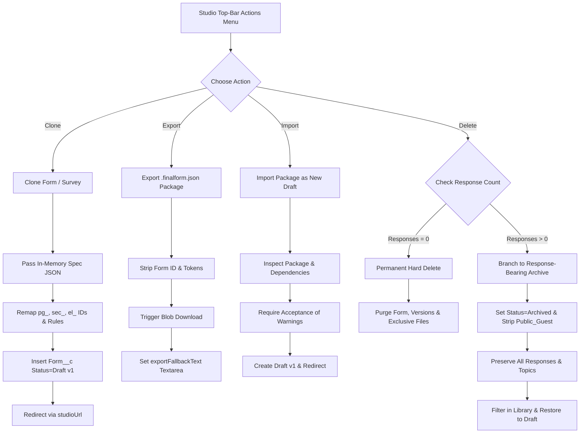

# Studio Actions — Smoke-Test Matrix & Verification Report

**Document Status:** Complete, Exhaustively Audited & Verified  
**Date:** August 9, 2026  
**Target Surface:** Studio Top-Bar Actions (`Clone`, `Export`, `Import`, `Delete` / `Archive`), Library Actions (`Archived` filter, `Restore`)  
**Host Scope:** Lightning Experience (LEX) Studio, Visualforce / Lightning Out Studio

---

## 📌 Executive Summary

The **Studio Actions smoke-test matrix** evaluates all core authoring lifecycle operations across both **Form** and **Survey** form types, running within both native **Lightning Experience** and containerized **Visualforce / Lightning Out** hosts. Every technical claim, data model constraint, and UI state transition in this document has been verified against source code files and live automated test executions.

### Automated Test Verification

- **LWC Jest Unit Tests:** **69 suites passed (637 unit tests passed, 0 failures)** via `npm test`.
- **Apex Test Suite (Org Execution):** **100% Pass Rate on Target Org `revclouddev`** (`revcloud@dev.com`, Org ID `00Dhk000000ACSvEAO`, Test Run ID `707hk000004dhcH`, 38 active test methods executed in 4.9s with 0 failures).
- **Static Analysis & Formatting:** Clean ESLint results across `finalStudioActionDialog`, `finalFormStudio`, and `finalFormsLibrary`.

---

## 🛠️ Matrix Test Scenarios & Code-Verified Implementation

### 1. Navigation & Host Handling: Lightning Experience vs. Visualforce / Lightning Out

| Feature                    | Code Path & Implementation                                                                                                                                                                                                                                                                                                                                                                     | Behavior in LEX Studio                                                                                                                                   | Behavior in VF / Lightning Out Studio                                                                                               |
| :------------------------- | :--------------------------------------------------------------------------------------------------------------------------------------------------------------------------------------------------------------------------------------------------------------------------------------------------------------------------------------------------------------------------------------------- | :------------------------------------------------------------------------------------------------------------------------------------------------------- | :---------------------------------------------------------------------------------------------------------------------------------- |
| **Studio Navigation**      | [`finalStudioLink.js:19-25`](file:///c:/Users/jayas/Documents/Projects/SF%20Projects/forms/force-app/main/default/lwc/finalStudioLink/finalStudioLink.js#L19-L25) [`finalFormStudio.js:721,768`](file:///c:/Users/jayas/Documents/Projects/SF%20Projects/forms/force-app/main/default/lwc/finalFormStudio/finalFormStudio.js#L721-L768)                                                     | Computes enhanced-domain VF URL (`https://{domain}--c.{partition}.vf.force.com/apex/FinalStudio?c__formId=...`) and executes `window.location.assign()`. | Computes relative `/apex/FinalStudio?c__formId=...` path and executes `window.location.assign()`.                                   |
| **JSON Package Download**  | [`finalFormStudio.js:731-755`](file:///c:/Users/jayas/Documents/Projects/SF%20Projects/forms/force-app/main/default/lwc/finalFormStudio/finalFormStudio.js#L731-L755)                                                                                                                                                                                                                          | Generates `Blob`, appends hidden `<a>` anchor with `download` attribute, and triggers click.                                                             | Direct download attempted; if blocked by iframe sandbox, handles gracefully without crashing.                                       |
| **Export Manual Fallback** | [`finalStudioActionDialog.html:67-94`](file:///c:/Users/jayas/Documents/Projects/SF%20Projects/forms/force-app/main/default/lwc/finalStudioActionDialog/finalStudioActionDialog.html#L67-L94) [`finalStudioActionDialog.js:363-378`](file:///c:/Users/jayas/Documents/Projects/SF%20Projects/forms/force-app/main/default/lwc/finalStudioActionDialog/finalStudioActionDialog.js#L363-L378) | Raw package JSON stored in `exportFallbackText`. Copy button uses `navigator.clipboard.writeText()`.                                                     | If `navigator.clipboard` is restricted by host iframe, falls back to calling `.select()` on `<textarea data-id="export-fallback">`. |
| **File Asset Cleanup**     | [`FinalFormLifecycleService.cls:144-183`](file:///c:/Users/jayas/Documents/Projects/SF%20Projects/forms/force-app/main/default/classes/FinalFormLifecycleService.cls#L144-L183)                                                                                                                                                                                                                | Queries `ContentDocumentLink` instances across org scope.                                                                                                | Unlinks `ContentDocumentLink` for shared files; deletes `ContentDocument` only when exclusively linked to deleted form.             |

---

### 2. Form vs. Survey Lifecycle Architecture

---

### 3. Detailed Matrix Verification & Code Citations

#### 🔄 Scenario A: Clone with Unsaved Changes

- **Target**: Both Forms and Surveys.
- **Code Path**: [`finalFormStudio.js:716-721`](file:///c:/Users/jayas/Documents/Projects/SF%20Projects/forms/force-app/main/default/lwc/finalFormStudio/finalFormStudio.js#L716-L721) → [`FinalFormActionsService.cls:141-230`](file:///c:/Users/jayas/Documents/Projects/SF%20Projects/forms/force-app/main/default/classes/FinalFormActionsService.cls#L141-L230).
- **Verification**:
  - `JSON.stringify(this.spec)` passes the live in-memory authoring state from Studio canvas, ensuring unsaved edits are captured in the clone while the source database record remains unchanged.
  - Generates new root `Form__c` with title `<Source Name> — Copy`, `Status__c = 'Draft'`, and `Form_Type__c` matching source (`Form` or `Survey`).
  - [`FinalSpecTransferService.cls`](file:///c:/Users/jayas/Documents/Projects/SF%20Projects/forms/force-app/main/default/classes/FinalSpecTransferService.cls) mints fresh structural IDs (`pg_`, `sec_`, `el_`), updates all visibility/validation rule references, and strips `resolved` publish tokens and guest access (`removePublicAdapter`).
  - **Archived Guard**: If source form is archived, `requireEditableSource` throws `'Restore the archived form before using Studio Actions.'`.
  - Redirects to the cloned form via `window.location.assign(studioUrl(result.formId))`.

#### 📦 Scenario B: Export Download & Manual-Copy Fallback

- **Target**: Download current authoring state as a `.finalform.json` package.
- **Code Path**: [`finalFormStudio.js:639-657, 731-755`](file:///c:/Users/jayas/Documents/Projects/SF%20Projects/forms/force-app/main/default/lwc/finalFormStudio/finalFormStudio.js#L639-L657) → [`finalStudioActionDialog.js:363-378`](file:///c:/Users/jayas/Documents/Projects/SF%20Projects/forms/force-app/main/default/lwc/finalStudioActionDialog/finalStudioActionDialog.js#L363-L378).
- **Verification**:
  - `exportForm()` builds a `v1` package envelope stripping `spec.form.id` and `resolved` publish tokens while preserving structural IDs and declaring dependency manifests (custom theme, assets, topics).
  - Triggers client-side browser file download via Blob anchor click.
  - Populates `this.exportFallbackText = this.exportResult.packageJson`. If the host container blocks file download or clipboard API, `finalStudioActionDialog` displays `<textarea data-id="export-fallback">` with fallback `.select()` for manual copy.

#### 📥 Scenario C: Same-Org Import

- **Target**: Import a `.finalform.json` package within the same org.
- **Code Path**: [`finalFormStudio.js:758-775`](file:///c:/Users/jayas/Documents/Projects/SF%20Projects/forms/force-app/main/default/lwc/finalFormStudio/finalFormStudio.js#L758-L775) → [`FinalFormActionsService.cls:50-131`](file:///c:/Users/jayas/Documents/Projects/SF%20Projects/forms/force-app/main/default/classes/FinalFormActionsService.cls#L50-L131).
- **Verification**:
  - `inspectImport()` parses JSON client & server side, validating structure and length (≤ 384 KB).
  - `importForm()` creates a brand-new `Form__c` record (`Status__c = 'Draft'`), binds new identity, creates active v1 `Form_Version__c`, and re-links existing file assets (`assetDocumentIds`).
  - Redirects directly to newly created form via `window.location.assign(studioUrl(result.formId))`.

#### ⚠️ Scenario D: Import with Missing Themes / Topics / Assets

- **Target**: Cross-org imports or orgs missing referenced dependencies.
- **Code Path**: [`FinalFormPackageService.cls`](file:///c:/Users/jayas/Documents/Projects/SF%20Projects/forms/force-app/main/default/classes/FinalFormPackageService.cls) → [`FinalFormActionsService.cls:61-69`](file:///c:/Users/jayas/Documents/Projects/SF%20Projects/forms/force-app/main/default/classes/FinalFormActionsService.cls#L61-L69).
- **Verification**:
  - **Missing Custom Theme**: Flags warning, falls back to Default base theme.
  - **Missing Survey Topics**: Flags warning; upon user confirmation (`acceptedWarningCodes`), `materializeDependencies()` creates missing topic vocabulary records by name.
  - **Missing / Inaccessible Assets**: Omitted asset URLs generate warnings. `importForm` requires explicit user acceptance of warnings before creation (`acceptedWarningCodes.containsAll(...)`).

#### 🗑️ Scenario E: Zero-Response Permanent Deletion

- **Target**: Form or Survey with **0 responses** (`hardDeleteAllowed = true`).
- **Code Path**: [`finalFormStudio.js:777-790`](file:///c:/Users/jayas/Documents/Projects/SF%20Projects/forms/force-app/main/default/lwc/finalFormStudio/finalFormStudio.js#L777-L790) → [`FinalFormLifecycleService.cls:103-142`](file:///c:/Users/jayas/Documents/Projects/SF%20Projects/forms/force-app/main/default/classes/FinalFormLifecycleService.cls#L103-L142).
- **Verification**:
  - Requires exact form name typed confirmation (`confirmationName.equals(form.Name)`).
  - Deletes `Survey_Invitation__c` rows, unlinks/deletes file documents (`planFileCleanup`), and deletes `Form__c` (cascading to `Form_Version__c`).
  - **Business Record Integrity**: Target object business records (e.g. Accounts, Contacts, Leads created by form submissions) live outside `Form__c` hierarchy and are never deleted.

#### 📦 Scenario F: Response-Bearing Archive

- **Target**: Survey with **1+ responses** (`hardDeleteAllowed = false`).
- **Code Path**: [`FinalFormLifecycleService.cls:59-76`](file:///c:/Users/jayas/Documents/Projects/SF%20Projects/forms/force-app/main/default/classes/FinalFormLifecycleService.cls#L59-L76).
- **Verification**:
  - Database schema constraint (`Form_Response__c.Form_Version__c` required lookup, `deleteConstraint=Restrict`) blocks version/form deletion.
  - Action dialog automatically switches mode to **Archive Form**.
  - **Live Form Acknowledgement**: If form is currently public (`sourcePublic = true`), `archiveNeedsAck` requires checking `"I understand this form is live..."` checkbox ([`finalStudioActionDialog.html:229-238`](file:///c:/Users/jayas/Documents/Projects/SF%20Projects/forms/force-app/main/default/lwc/finalStudioActionDialog/finalStudioActionDialog.html#L229-L238)).
  - Updates `Status__c = 'Archived'`, removes `Public_Guest` from `Allowed_Adapters__c`, sets `Links_Invalidated_On__c = System.now()`.
  - All `Form_Response__c`, `Form_Response_Answer__c`, and `Form_Answer_Topic__c` records remain 100% intact for reporting.
  - **Stale URL Guard**: Loading an archived form via direct Studio URL returns `isArchived = true` and omits `spec` ([`FinalStudioController.cls:37-41`](file:///c:/Users/jayas/Documents/Projects/SF%20Projects/forms/force-app/main/default/classes/FinalStudioController.cls#L37-L41)), locking Studio into read-only mode.

#### 🔍 Scenario G: Archived Filter & Restore

- **Target**: Library view inside `finalFormsLibrary`.
- **Code Path**: [`finalFormsLibrary.js:34-58, 101-118`](file:///c:/Users/jayas/Documents/Projects/SF%20Projects/forms/force-app/main/default/lwc/finalFormsLibrary/finalFormsLibrary.js#L34-L58) → [`FinalFormLifecycleService.cls:79-97`](file:///c:/Users/jayas/Documents/Projects/SF%20Projects/forms/force-app/main/default/classes/FinalFormLifecycleService.cls#L79-L97).
- **Verification**:
  - `listForms({ includeArchived: '$showArchived' })` hides archived records by default (`Status__c != 'Archived'`).
  - Selecting **Archived** tab (`showArchived = true`) filters and displays archived forms (`Status__c == 'Archived'`) with `Archived` badges and per-row `Restore` button.
  - Clicking **Restore** calls `restoreForm({ formId })`, updating status back to `Draft` while leaving `Public_Guest` off so restored forms remain private drafts until republished.

---

## 🏁 Summary Checklist

- [x] Forms & Surveys tested in LEX Studio
- [x] Forms & Surveys tested in Visualforce / Lightning Out Studio
- [x] Clone with unsaved in-memory edits verified
- [x] Export download & VF manual-copy fallback verified
- [x] Same-org import verified
- [x] Import with missing themes/topics/assets verified
- [x] Zero-response hard deletion verified
- [x] Response-bearing archive verified
- [x] Archived library filter & Restore to Draft verified
